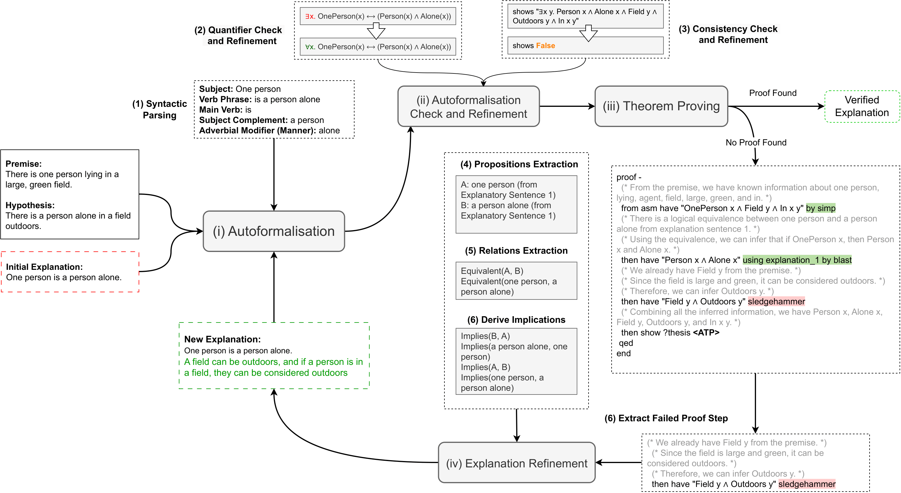

# Faithful and Robust LLM-Driven Theorem Proving for NLI Explanations (ACL 2025)

Natural language explanations play a fundamental role in Natural Language Inference (NLI) by revealing how premises logically entail hypotheses. Recent work has shown that the interaction of large language models (LLMs) with theorem provers (TPs) can help verify and improve the validity of NLI explanations. However, TPs require translating natural language into machine-verifiable formal representations, a process that introduces the risk of semantic information loss and unfaithful interpretation, an issue compounded by LLMs' challenges in capturing critical logical structures with sufficient precision. Moreover, LLMs are still limited in their capacity for rigorous and robust proof construction within formal verification frameworks. To mitigate issues related to faithfulness and robustness, this paper investigates strategies to (1) alleviate semantic loss during autoformalisation, (2) efficiently identify and correct syntactic errors in logical representations, (3) explicitly use logical expressions to guide LLMs in generating structured proof sketches, and (4) increase LLMs' capacity of interpreting TP's feedback for iterative refinement. Our empirical results on e-SNLI, QASC and WorldTree using different LLMs demonstrate that the proposed strategies yield significant improvements in autoformalisation (+18.46%, +34.2%, +39.77%) and explanation refinement (+29.5%, +51.5%, +41.25%) over the state-of-the-art model. Moreover, we show that specific interventions on the hybrid LLM-TP architecture can substantially improve efficiency, drastically reducing the number of iterations required for successful verification.

ACL 2025 main paper: https://aclanthology.org/2025.acl-long.867

High-level overview of the framework:



## Install Dependencies

### Python Libraries

To install all the required Python libraries for running, clone the repository locally and execute the following command:

```bash
pip install -r requirements.txt
```

> **Note:** This project requires `isabelle-client==0.5.0`.  
> Please ensure that you are using this exact version for compatibility.


#### Isabelle Linux Installation:

Download Isabelle2023 in your working directory (e.g., Desktop):

```bash
wget https://isabelle.in.tum.de/website-Isabelle2023/dist/Isabelle2023_linux.tar.gz
tar -xzf Isabelle2023_linux.tar.gz --no-same-owner
```

Append Isabelle2023's bin directory to your PATH
```bash
export PATH=$PATH:/workspace/Isabelle2023/bin 
```

#### Isabelle macOS Installation:

Download Isabelle2023/2024 for macOS from the official website: https://isabelle.in.tum.de/

Append Isabelle2023's bin directory to your PATH
```bash
export PATH=$PATH:/Users/user/Desktop/Isabelle2023.app/bin
```
#### Isabelle python notebook:

When using isabelle-client inside Jupyter, both Jupyter and isabelle-client rely on asyncio, requiring nested event loops to be enabled. This step is not necessary when running isabelle-client from standalone Python scripts outside of Jupyter.

```
import nest_asyncio
nest_asyncio.apply()
import os
original_path = os.environ.get('PATH', '')
new_path = original_path + ':/workspace/Isabelle2023/bin'
os.environ['PATH'] = new_path
print(os.environ['PATH'])
```

#### API Keys
Set your `api_key` in the `config.yaml` file to use the generative models.

#### Configuration

In `config.yaml`, please set `isabelle.master_dir` to the **absolute path** of the Isabelle formalisation directory:

```yaml
isabelle:
  master_dir: '/path/to/faithful_and_robust_nli_refinement/formalisation/isabelle'
```

#### Reproducibility
Clone this repository into the same directory where you installed Isabelle. Run the following command:

```bash
python main.py --llm <llm_name> --data <dataset_name>
```

#### Example Usage:
To run the model gpt-4o on the example dataset with the default number of iterations:

```bash
python main.py -l gpt-4o -d example
```

## Reference

If you find this repository useful, please consider citing our paper. 

```
@inproceedings{quan-etal-2025-faithful,
    title = "Faithful and Robust {LLM}-Driven Theorem Proving for {NLI} Explanations",
    author = "Quan, Xin  and
      Valentino, Marco  and
      Dennis, Louise A.  and
      Freitas, Andre",
    editor = "Che, Wanxiang  and
      Nabende, Joyce  and
      Shutova, Ekaterina  and
      Pilehvar, Mohammad Taher",
    booktitle = "Proceedings of the 63rd Annual Meeting of the Association for Computational Linguistics (Volume 1: Long Papers)",
    month = jul,
    year = "2025",
    address = "Vienna, Austria",
    publisher = "Association for Computational Linguistics",
    url = "https://aclanthology.org/2025.acl-long.867/",
    doi = "10.18653/v1/2025.acl-long.867",
    pages = "17734--17755",
    ISBN = "979-8-89176-251-0"
}
```

